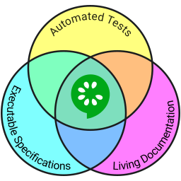

# 

 

Cucumber is a tool that supports [Behaviour-Driven Development (BDD)](#) - a software
development process that aims to enhance software quality and reduce maintenance costs.

Cucumber executes *executable specifications* written in [plain language](docs/gherkin.md)
and produces reports indicating whether the software behaves according to the
specification or not.

Cucumber reduces the effort to keep requirements specifications, tests and documentation
in sync - with Cucumber they are all the same documents - a single source of truth
for everyone on the team.

Cucumber is compatible with all the major software platforms.
