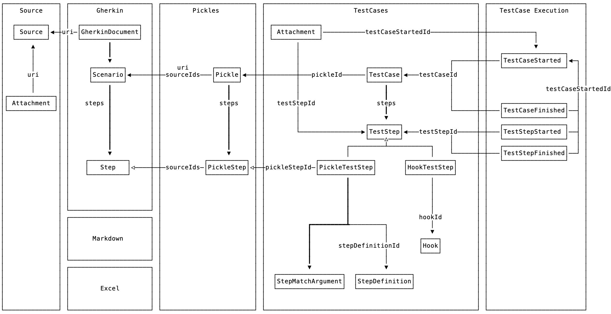

# Cucumber Messages

Cucumber consists of several components written in different programming languages:
- Go
- Ruby
- Java
- JavaScript
- C#
- And more...

These components need to exchange data between them. This is done using *Cucumber Messages*.

Cucumber Messages is a message protocol based on [Protocol Buffers](https://developers.google.com/protocol-buffers/). It allows one process to construct message objects and send them to another process. 
Protobuf takes care of serialising those messages to a binary format, and deserialise them on the other
end.

The messages are defined in [messages.proto](./messages.proto).

Each subdirectory defines language-specific implementations of these messages,
generated with `protoc` - the Protobuf compiler.

## Overview

The protocol aims to decouple various components of the Cucumber platform so that:

* Each component only needs to know about a subset of messages
* Gherkin is decoupled from the Cucumber execution component
  * This is part of a strategy to support other formats such as Markdown and Excel
  

## Detailed message documentation

See the generated [messages.md](messages.md) file.
