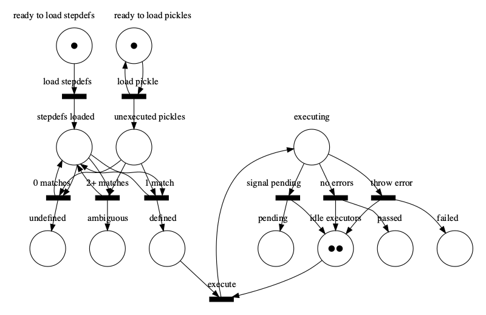

# Cucumber Protocol

The Cucumber Protocol is a specification of how various Cucumber components
interact. The Cucumber Protocol consists of two distinct protocols - the
*Execution Protocol* and the *Reporting Protocol*.

```
+------------------+                  +-------------+   
| Step Definitions |                  |    User     |   
|     & Hooks      |                  |  Interface  |   
+------------------+                  +-------------+   
          ^                                  ^          
          |                                  |          
   function calls                     function calls    
          |       +----------------+         |          
          |       |    Cucumber    |         |          
          +------>|   Front-End    |<--------+          
                  +----------------+                    
                           ^                            
                           |                 
              Execution Protocol (duplex)    
                           |                 
                           v                            
 +---------------------------------------------------+  
 |                  Cucumber Engine                  |  
 |                                                   |  
 |  +-----------+ +-----------------+ +-----------+  |  
 |  |  Gherkin  | |    Cucumber     | |    Tag    |  |  
 |  |  Parser   | |   Expressions   | |Expressions|  |  
 |  +-----------+ +-----------------+ +-----------+  |  
 +---------------------------------------------------+  
                           |                 
                           |                 
             Reporting Protocol (simplex)    
                           |                 
                           v                 
                  +----------------+                    
                  |    Cucumber    |                    
                  |    Reporter    |                    
                  +----------------+        
```

The protocols use [cucumber-messages](../cucumber-messages/README.md) to exchange
messages.

Step definitions and hooks use a programmatic API defined by the *Cucumber Front-End* component.
This component also provides a programmatic API for executing tests via a user interface 
(typically a command-line interface or an editor/IDE plugin). 

The Front-End communicates with the Engine via [cucumber-messages](../cucumber-messages/README.md). 
The Engine communicates results to one or more reporters, also using [cucumber-messages](../cucumber-messages/README.md).

## Formal definition

The behaviour of the whole system is described by the [Petri Net](https://en.wikipedia.org/wiki/Petri_net) below. 



The Petri Net (PN) notation has been chosen over the more traditional state 
machine diagram notation because the latter leads to a combinatorial explosion of 
states while a PN can describe the system more concisely.

### Modifying the definition

We use [PIPE](https://github.com/sarahtattersall/PIPE/releases/tag/PIPE-5.0.2) 
to modify and simulate execution. The [PNML](https://en.wikipedia.org/wiki/Petri_Net_Markup_Language) 
definition is in `src/cucumber-protocol.xml`. Run PIPE to start the gui and open the file:

    # Make sure you're using Java8 - doesn't work on newer versions
    java -jar PIPE-gui-5.0.2.jar

After saving the PNML you can regenerate the images

    make

### Petri Net resources

* [Introduction to Petri Nets](https://www.site.uottawa.ca/~bochmann/ELG7187C/CourseNotes/BehaviorModeling/Petri-nets/index.html)
* [Petri nets are good for protocols](https://dl.acm.org/citation.cfm?id=802062) (Sign-in required. It's free)

## Polyglot implementations

The *Cucumber Front-End* is the only component that *must* have an implementation native to
the target platform. This is because user code (step definition and hooks) need a native
API to interact with.

The official *Cucumber Engine* is written in Go, and can be used by any front-end as long
as it speaks the *Cucumber Protocol*. 

Some Cucumber implementations may choose to implement the engine (and even reporters) natively.
This allows all the components to run in the same process. It also allows installation and distribution
to be done as a single entity. This comes at a cost as there is more code to maintain, but
the benefit is a simpler installation process which is less likely to trip up corporate security
infrastructure that may stop the download and installation of executables.

Fully-native implementations should still expose the components via the 
Cucumber Protocol, even if the protocol is not used internally. This allows the implementation to
use the cross-platform compatibility test suite.

## Cucumber Engine

The *Cucumber Engine* component is responsible for orchestrating the execution of tests.

```
+---------------------------------------------------+  
|                  Cucumber Engine                  |  
|                                                   |  
|  +-----------+ +-----------------+ +-----------+  |  
|  |  Gherkin  | |    Cucumber     | |    Tag    |  |  
|  |  Parser   | |   Expressions   | |Expressions|  |  
|  +-----------+ +-----------------+ +-----------+  |  
+---------------------------------------------------+  
```

To do this it performs the following tasks:

- Use the *Gherkin Parser* component to convert Gherkin documents into *pickles*
- Select what pickles to run based on front-end-provided *tags* and *line number filters*
- Use the *Cucumber Expressions* component to parse Cucumber Expressions
  - 3rd party implementations may choose to only support *Regular Expressions* for simplicity
- Create executable *test cases* for each *pickle* by linking it to a step definition with a matching *Cucumber Expression* or *Regular Expression*
- Tell the *front-end* to execute step definitions and hooks
- Collect results from *front-end* and forward them to reporters

## Reporters

The *reporter* components are responsible for generating reports, using results forwarded
by the *Cucumber Engine* (and optionally Gherkin Document ASTs for advanced reports).

There are three broad categories of reporters:

* Console reporters print to the console
* File reporters generate files (such as HTML documents)
* Integrated reporters display results in another tool (IDE, Excel, etc)

## Testing

Cucumber's own tests use three categories of tests.

### Acceptance tests

These tests assemble a full system, with front-end, engine and reporters. These
are approval tests. They could have been written with Gherkin embedded in Gherkin
(as Cucumber's own Cucumber scenarios). We have chosen a similar test, but with
context (input files) as separate files. The expected outcome (reporter output)
is also stored in a file with a similar name to the input file.

This still achieves the goals of BDD:
- Common understanding
- Readable executable specifications
- Living documentation
- Automated acceptance tests

### Protocol tests

These tests test a component in isolation. We could call them component tests.
These tests follow a simple pattern:
- One or more input messages.
- One or more expected output message.
- Send the input messages to the component via STDIN, socket or in-memory stream.
- Send a `Quit` message with reason `Reason.FINISH_PLEASE`.
- Wait for the connection to close.
- Compare the received messages with the expected ones.

These approval messages are stored in the `examples` directory as both `.json`
files and `.bin` files (in binary protobuf format). They are generated by `make`,
and their contents are derived from `Example:` annotations in the message and
field comments.

This also provides a form of living documentation. These `.json` messages are effectively
*examples* of a message type, and can be displayed next to the formal definition
of a message.

Some messages will be used as expected output messages for one component's tests, and
as input messages for another one's tests. This is a way to verify a *contract*
between two components, so we can think of them as a kind of *contract test*.

### Unit tests

These tests are internal to the component, and test smaller parts of the component, 
typically classes and functions. We prefer most of these tests to be TDD'ed, as we
rely on the *pressure* from the test to continuously improve the internal design through
refactoring.