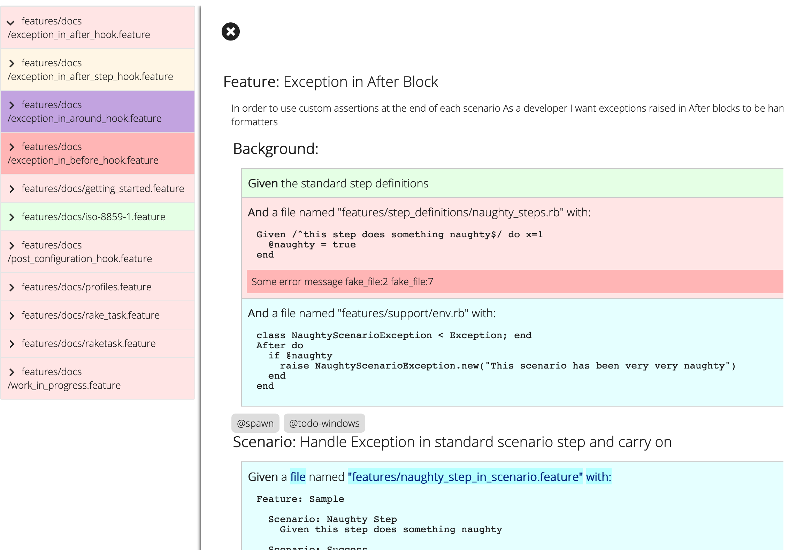

# Cucumber-React

Cucumber-React is a set of React components for rendering Gherkin documents and Cucumber results.

## Overview

This screnshot renders the [`<App>`](src/components/app/App.tsx) component, which has a 
[`<GherkinDocumentSideNav>`](src/components/app/GherkinDocumentSideNav.tsx) component on the left,
and a [`<GherkinDocument>`](src/components/gherkin/GherkinDocument.tsx) on the right.

The `<GherkinDocument>` component and everything inside it is the "reusable" part of this library.
It's intended to be embeddable in other web applications to display the contents of a Gherkin document.

## `<GherkinDocument>` features

The `<GherkinDocument>` component is instantiated with a single `gherkinDocument` prop, which is a
`GherkinDocument` object returned by the Gherkin 8 parser and defined in [cucumber-messages](../../cucumber-messages/messages.md#io.cucumber.messages.GherkinDocument) library.

By default the `<GherkinDocument>` component will not display any coloured results, as the `GherkinDocument`
message object does not contain results, only the [AST](https://en.wikipedia.org/wiki/Abstract_syntax_tree) of the document. 
This is fine for simple use cases where results are not important.

To render a `<GherkinDocument>` with results, it must be nested inside a 
[`<ResultsLookupByLineContext.Provider>`](src/ResultsLookupByLineContext.ts) component.

Similarly, if you want to highlight [Cucumber Expression parameters](https://cucumber.io/docs/cucumber/cucumber-expressions/) 
or Regexp capture groups, you have to nest `<GherkinDocument>` inside a [`<StepMatchLookupByLineContext.Provider>`](src/StepMatchLookupByLineContext.ts)
component.

An example of how this is done is in [`<App>`](src/components/app/App.tsx). The messages for results and step matches are also
defined in [cucumber-messages](../../cucumber-messages/messages.md), and provided by Cucumber implementations that
implement a `protobuf` formatter.

## Build / hack

Install dependencies

    npm install

Run tests

    npm test

Interactive development

    npm run storybook

## Ideas

### `ScenarioList` component

A component that renders a list of scenarios (possibly from multiple files, filtered by e.g. tag). 

This component could be used to render relevant scenarios in 3rd-party tools, such as 
JIRA, Confluence and various issue trackers that support plugins.

### Link to JIRA

Configure with a regexp and url function, and tags will be rendered as JIRA issue links

### Search

Search by tag, but also by text. Could use http://elasticlunr.com/
or https://lunrjs.com/ - or it could simply perform filtering on an array of `GherkinDocument` messages.

### Search results

Each scenario displayed underneath each other, grouped by feature file. The feature description is "collapsed", 
(unless it contains the search term) but can be opened.

### Filtering / sorting

* by tag
* by duration (find slow ones)
* by status
* by recency (update timestamp) - exclude old ones
* by flickeriness

### Tag search

* Render a tag cloud for all tags
  * Size: count
  * Color: pass/fail/undefined
    
### On-demand data

For large reports (especially with screenshots) it may be too heavy to store it all in the browser.
The GUI should request data for the current document on demand. The GUI should also be able to filter
what kind of events it wants. For example, to render the initial screen.

### Server / App

It should be easy to use. Just run the app (Electron). It will create a named pipe where
it will listen. What's written here gets written straight to the React app (no websocket,
it's in the same process). This app can be fairly small.

### Rerun tests

Add a message to represent a config+cwd+env for a run, so the GUI can rerun it.
The config is essentially command line options. They can be modified in the gui.
Rerun on file change can also be set up. This just makes the whole DX simple.

### Alerts

The app could use the OS to send screen messages (autotest like)

