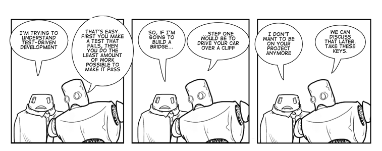

## Test Driven Development

Test Driven Development is a developer practice that involves writing tests before writing the code being tested. Begin by writing a very small test for code that does not yet exist. Run the test and, naturally, it fails. Now write just enough code to make that test pass. Once the test passes, observe the resulting design and re-factor to remove any duplication you see. It is natural at this point to judge the design as too simple to handle all of the responsibilities this code will have.

As the code base gradually increases in size, more and more attention is consumed by the re-factoring step. The design is constantly evolving and under constant review, though it is not predetermined. This process is known as emergent design, and is one of the most significant by products of Test Driven Development. 

   *PC:James kersky*

