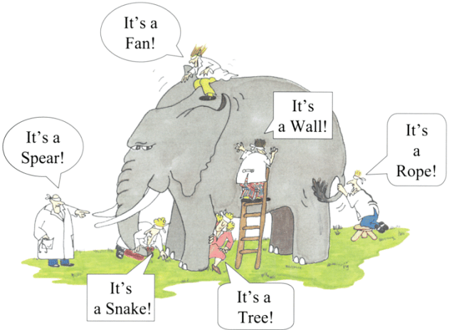
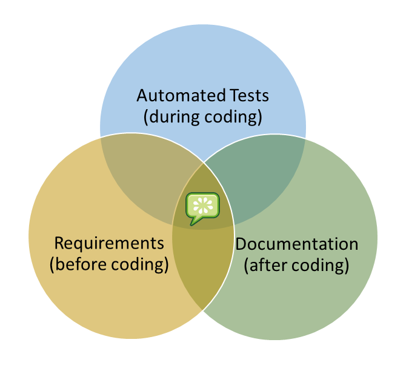

## Behavior Driven Development(BDD):

   Behavior driven development (or BDD) is an agile software development technique that encourages collaboration between developers, QA and non-technical or business participants in a software project.

   BDD focuses on obtaining a clear understanding of desired software behavior through discussion with stakeholders. It extends TDD by writing test cases in a natural language that non-programmers can read. Behavior-driven developers use their native language in combination with the ubiquitous language of domain driven design to describe the purpose and benefit of their code. This allow the developers to focus on why the code should be created, rather than the technical details, and minimizes translation between the technical language in which the code is written and the domain language spoken by the business, users, stakeholders, project management, etc.
     
   Coming to reality Customer is a person who is an expert in dealing the things other than Technology. They need not to be aware of Edge case scenarios,beta testing and Alpha testing and so on. Even if he(customer) is familiar of the Technology stack,the only thing that is evolving in much faster pace is business, which change at constant pace.
     
   In this modern Agile world, teams understands the business change and structure their approach according to the business needs.Rather attempt to conceive, build, and deliver the perfect application in one fell swoop, they steadily deliver work in small and usable chunks for every few weeks.  The customer is encouraged to think in terms of what functionality will be delivered at the maximum benefit to the business and prioritize the pipeline of work accordingly.
     
  

   This is where BDD comes in.  It bakes quality into the process by smoothing communication between stakeholders.  
  
  The BDD process looks like this:

  A Subject-Matter-Expert (typically a business user) works with a Business Analyst to identify a business requirement. 
  
  *This is expressed as a story using the following template:*

|As a Role
|-
|I request a Feature
|To gain a Benefit
|The speaker, who holds the Role, is the person who will gain the Benefit from the requested Feature.

This can also be paraphrased variously as ...

I want to achieve a specific Goal, and as a Role I should be able to accomplish this by performing Functionality.
A Role invokes Feature to cause a Benefit[1]

Software teams work best when the developers and business stakeholders
are communicating clearly with one another. A great way to do that is to
collaboratively specify the work that’s about to be done using automated
acceptance tests.

When the acceptance tests are written as examples, they stimulate people’s
imaginations and help them see other scenarios they hadn’t previously
considered.

When the team write their acceptance tests collaboratively, they can develop
their own ubiquitous language for talking about their problem domain. This
helps them avoid misunderstandings.[2]
   
   
   **"Behavior-driven development is about implementing an application by describing its behavior from the perspective of its stakeholders”** -- DAN North

# BDD with Cucumber:
     
   Cucumber is a command-line tool. When you run it, it reads in your specifications from plain-language text files called features, examines them for scenarios to test, and runs the scenarios against your system. Each scenario is a list of steps for Cucumber to work through. So that Cucumber can understand these feature files, they must follow some basic syntax rules. The name for this set of rules is Gherkin.
     
 
   
Along with the features, you give Cucumber a set of step definitions, which
map the business-readable language of each step into Ruby code to carry out
whatever action is being described by the step. In a mature test suite, the
step definition itself will probably just be one or two lines of Ruby that delegate to a library of support code, specific to the domain of your application, that knows how to carry out common tasks on the system. Normally that will involve using an automation library, like the browser automation library Capybara, to interact with the system itself.[2]
    

### Example
   What makes Cucumber to stand out from the crowd of other testing tools is that it has been designed specifically to ensure the acceptance tests can easily be read and written by anyone on the team. This reveals the true value of acceptance tests: as a communication and collaboration tool. The easy readability of Cucumber tests draws business stakeholders into the process, helping you really explore and understand their requirements.
   
   Here is an example of a Cucumber acceptance test:
   
**Feature: Sign up Sign up should be quick and friendly**

|**Scenario**: Successful sign up.  New users should get a confirmation email and greeted personally by the site once signed in.
| -- |
|**Given** I have chosen to sign up
|**When** I sign up with valid details
|**Then** I should receive a confirmation email
|**And** I should see a personalized greeting message

|**Scenario**: Duplicate email. Where someone tries to create an account for an email address that already exists.
| -- |
|**Given** I have chosen to sign up
|**But** I enter an email address that has already registered
|**Then ** I should be told that the email is already registered
|**And** I should be offered the option to recover my password

   Notice how the tests specified as examples of the way we want the system to behave in particular scenarios. Using the examples like this has an unexpectedly powerful effect in enabling people to visualize the system before it has been built. Anyone from the team can go through the Feature file an can understand what is the system for, And how it works(functionality).This helps in analyzing the functionality of the system and come up with more scenarios where the system/software can be tested thoroughly
      
   In this way, we say that the story functions as a living document.  As the behavior of the system evolves over time, the team is forced to evolve the documentation in parallel.
   
  Acceptance tests written in this style become more than just tests,they are executable specifications with living documentation.
  
  

---

[1] [*BDD PROCESS*](http://behaviourdriven.org/BDDProcess)

[2] *THE CUCUMBER BOOK*