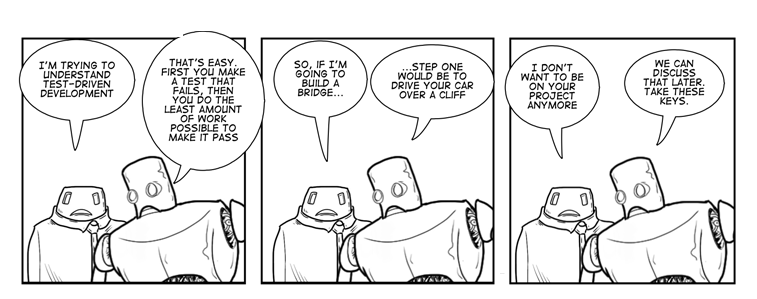
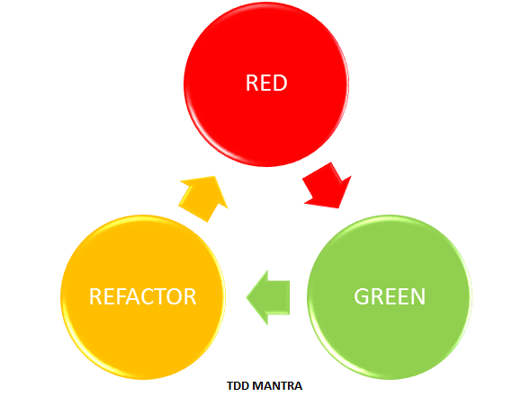

## Test Driven Development

Test-driven development (TDD) is a software development process that relies on the repetition of a very short development cycle: requirements are turned into very specific test cases, then the software is improved to pass the new tests. This is opposed to software development that allows software to be added that isn't proven to meet requirements.[1] Begin by writing a very small test for code that does not yet exist. Run the test and, naturally, it fails. Now write just enough code to make that test pass. Once the test passes, observe the resulting design and re-factor to remove any duplication you see. It is natural at this point to judge the design as too simple to handle all of the responsibilities this code will have.

As the code base gradually increases in size, more and more attention is consumed by the re-factoring step. The design is constantly evolving and under constant review, though it is not predetermined. This process is known as emergent design, and is one of the most significant by products of Test Driven Development. 

   *PC:James kersky*

Clean code that works, in Ron Jeffries' pithy phrase, is the goal of Test-Driven Development
(TDD). Clean code that works is a worthwhile goal for a whole bunch of reasons.
* It is a predictable way to develop. You know when you are finished, without having to worry about a long bug trail.
* It gives you a chance to learn all of the lessons that the code has to teach you. If you only slap together the first thing you think of, then you never have time to think of a second, better thing.
* It improves the lives of the users of your software.
* It lets your teammates count on you, and you on them.
* It feels good to write it.

But how do we get to clean code that works? Many forces drive us away from clean code,and even from code that works. Without taking too much counsel of our fears, here's what we do: we drive development with automated tests,a style of development called Test Driven Development (TDD). 

In Test-Driven Development, we 
* Write new code only, if an automated test has failed 
* Eliminate duplication

These are two simple rules, but they generate complex individual and group behavior with technical implications such as the following.
* We must design organically, with running code providing feedback between decisions.
* Programmers must write their own tests, because we can't wait 20 times per day for someone else to write a test.
* Our development environment must provide rapid response to small changes.
* Our designs must consist of many highly cohesive, loosely coupled components, just to make testing easy.

The two rules imply an order to the tasks of programming.
1. **Red**— Write a little test that doesn't work, and perhaps doesn't even compile at first.
2. **Green**— Make the test work quickly, committing whatever sins necessary in the process.
3. **Refactor**— Eliminate all of the duplication created in merely getting the test to work.
**Red/green/refactor—the TDD mantra.**[2]

---

[1] [*TDD Wiki*](https://en.wikipedia.org/wiki/Test-driven_development)

[2] *Test Driven Development by Kent Beck*
