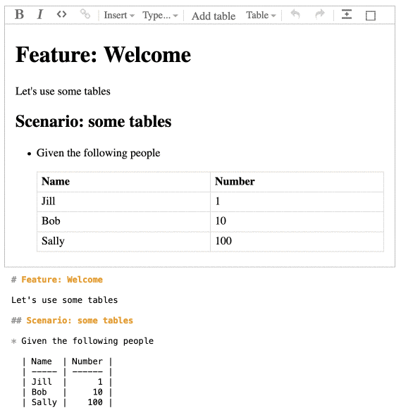

# Cucumber Markdown Editor

Cucumber Markdown Editor is a React component that renders a rich-text editor for editing Gherkin Markdown documents.

It can import and export Gherkin Markdown documents.

## Internal Design

The editor is based on [ProseMirror](https://prosemirror.net/)

## Screenshot

## TODO

### Basic syntax highlighting

Users must be able to visually distinguish the parts of the Markdown document that contains
Gherkin contents from "regular" Markdown contents. They also need to know if there are any
Gherkin parser syntax errors so they can fix them.

This can be done with basic syntax highlighting, for example highlighting Gherkin contents in
a light blue colour, and highlighting lines with parse errors in a light red colour.

High level overview of how this is currently done:

* For every edit, serialize the ProseMirror document to Markdown with `markdownSerializer`
* Parse the Markdown into a GherkinDocument using Gherkin and a `GherkinInMarkdownTokenMatcher`
* Walk the GherkinDocument and build a list of line numbers (`gherkinLines`) that should be highlighted
* Parse the Markdown into a new ProseMirror document using `makeMarkdownParser`
  * This will set a `gherkin` attribute on document nodes that are derived from Markdown nodes
    that have a line number in the `gherkinLines` list.
* Use [decorations](https://prosemirror.net/docs/ref/#view.Decorations) to add a `gherkin` class to DOM
  nodes corresponding to ProseMirror nodes with a `gherkin` attribute.

This works fine for the initial rendering. However, when the user edits the document, the `gherkin` classes
are not updated. For example, changing a non-Gherkin heading from `ScenariX` to `Scenario` does not
add the `gherkin` class.

