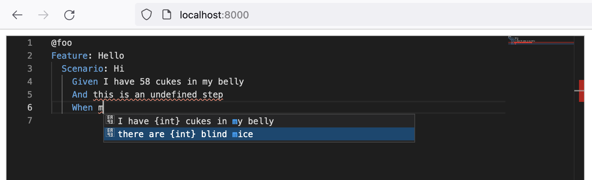
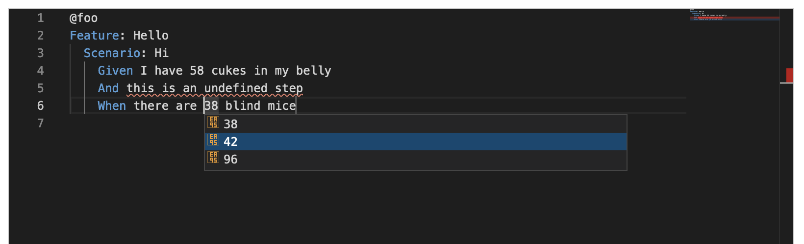

# Cucumber Monaco

This library configures a [monaco editor](https://github.com/microsoft/monaco-editor)
with editor features similar to the [Visual Studio Code Cucumber Extension](../../vscode/javascript).





The library is a small Monaco adapter for the [@cucumber/language-service](../../language-service/javascript)
library.

## Example

To build the example, run the following:

```
pushd ../..
npm install
npm run build
popd

npm run build
```

This should create additional (.gitigored) files in `./example`. Now, start a static web server in that directory:

```
cd examples
npx node-static -p 8000
```

Open http://localhost:8000
