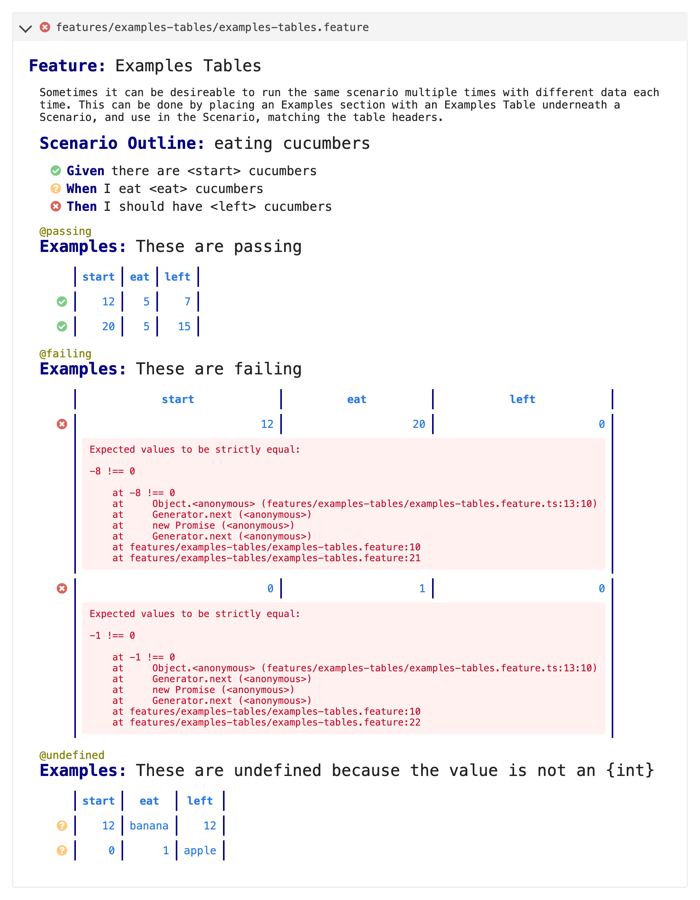

# Cucumber-React

Cucumber-React is a set of React components for rendering Gherkin documents and Cucumber results.

## Screenshot



## Usage

The source code for screenshots above is:

```jsx
<EnvelopesWrapper envelopes={envelopes}>
  <GherkinDocumentList />
</EnvelopesWrapper>
```

The [`<GherkinDocumentList>`](src/components/app/GherkinDocumentList.tsx) React component,
is an accordion of [`<GherkinDocument>`](src/components/gherkin/GherkinDocument.tsx).

The `<GherkinDocument>` React component and any component nested within it (such as [`<Scenario>`](src/components/gherkin/Scenario.tsx)) can be rendered standalone.

## `<GherkinDocument>` features

The `<GherkinDocument>` React component is instantiated with a single `gherkinDocument` prop.
The value must be a [GherkinDocument](../../cucumber-messages/messages.md#io.cucumber.messages.GherkinDocument) object.
You can use the [Gherkin](../../gherkin) parser to generate a `GherkinDocument` object.

By default the `<GherkinDocument>` component will not display any coloured results, as the `GherkinDocument`
message object does not contain results, only the [AST](https://en.wikipedia.org/wiki/Abstract_syntax_tree) of the document. 
This is fine for simple use cases where results are not important.

To render a `<GherkinDocument>` with results and highlighted [Cucumber Expression parameters](https://cucumber.io/docs/cucumber/cucumber-expressions/) parameters it must be nested inside a 
[`<Wrapper>`](src/components/app/Wrapper.tsx) component.

## Styling

The standard styling comes from wrapping your top-level usage with the `CucumberReact` component (sans-props). There are several ways you can apply different styling to the components.

### Built-in themes

These are the built-in themes:

- `light` (default)
- `dark`
- `auto` (honours your operating system preference for either light or dark)

You can activate one of these by passing the `theme` prop to the `CucumberReact` component:

```jsx
<CucumberReact theme="dark">
  <GherkinDocument />
</CucumberReact>
```

### Custom themes

You can also provide your own theme with a small amount of CSS. Pass the `CucumberReact` component a class name instead of a theme name:

```jsx
<CucumberReact className="acme-widgets">
  <GherkinDocument />
</CucumberReact>
```

In your CSS for the `acme-widgets` class, you can override the supported [custom property](https://developer.mozilla.org/en-US/docs/Web/CSS/--*) values as desired. Here's the CSS that drives the built-in "dark" theme:

```css
.darkTheme {
  --cucumber-background-color: #1d1d26;
  --cucumber-text-color: #c9c9d1;
  --cucumber-anchor-color: #4caaee;
  --cucumber-keyword-color: #d89077;
  --cucumber-parameter-color: #4caaee;
  --cucumber-tag-color: #85a658;
  --cucumber-docstring-color: #66a565;
  --cucumber-error-background-color: #cf6679;
  --cucumber-error-text-color: #222;
  --cucumber-code-background-color: #282a36;
  --cucumber-code-text-color: #f8f8f2;
  --cucumber-panel-background-color: #282a36;
  --cucumber-panel-accent-color: #313442;
  --cucumber-panel-text-color: #f8f8f2;
}
```

### Custom styles

For more control over the styling, you can override the CSS used by individual components.

Let's say you want to do something totally different with the typography of doc strings. In your own CSS, you might write something like:

```css
.acme-docstring {
  font-weight: bold;
  font-style: italic;
  background-color: black;
  color: hotpink;
  text-shadow: 1px 1px 2px white;
  padding: 10px;
}
```

Then, you can provide a `customRendering` prop to the `CucumberReact` component, in the form of an object that declares which class names you're going to override and what with:

```jsx
<CucumberReact customRendering={{
  DocString: {
    docString: 'acme-docstring'
  }
}}>
  <GherkinDocument />
</CucumberReact>
```

Some components have multiple styling hooks - e.g. the `<Tags>` component has the `tags` class name for the list, and the `tag` class name for each item. In these cases, you can provide custom class names for just the ones you want to change, and any you omit will pick up the built-in styling like normal.

### Custom rendering

To change the rendering of some components entirely, you can selectively provide your own component implementations to be used instead of the built-in ones.

Staying with the doc string example, you can use the same `customRendering` prop, but this time instead of an object with class names, you provide a React functional component, giving you full control over the rendering:

```jsx
<CucumberReact customRendering={{
  DocString: (props) => (
    <>
      <p>I am going to render this doc string in a textarea:</p>
      <textarea>{props.docString.content}</textarea>
    </>
  )
}}>
  <GherkinDocument />
</CucumberReact>
```

In each case where you provide your own component, it will receive the same props as the default component, plus two more:

- `styles` - class names for the default styling, so you can still apply these to your custom component if it makes sense
- `DefaultRenderer` - the default React component, useful if you only want to provide your own rendering for certain cases, and otherwise fall back to the default rendering (don't forget to pass it the props)

## Build / hack

Install dependencies

    npm install

Run tests

    npm test

Interactive development

    npm run storybook

## Ideas

### `ScenarioList` component

A component that renders a list of scenarios (possibly from multiple files, filtered by e.g. tag). 

This component could be used to render relevant scenarios in 3rd-party tools, such as 
JIRA, Confluence and various issue trackers that support plugins.

### Link to JIRA

Configure with a regexp and url function, and tags will be rendered as JIRA issue links

### Search

Search by tag, but also by text. Could use http://elasticlunr.com/
or https://lunrjs.com/ - or it could simply perform filtering on an array of `GherkinDocument` messages.

### Search results

Each scenario displayed underneath each other, grouped by feature file. The feature description is "collapsed", 
(unless it contains the search term) but can be opened.

### Filtering / sorting

* by tag
* by duration (find slow ones)
* by status
* by recency (update timestamp) - exclude old ones
* by flickeriness

### Tag search

* Render a tag cloud for all tags
  * Size: count
  * Color: pass/fail/undefined
    
### On-demand data

For large reports (especially with screenshots) it may be too heavy to store it all in the browser.
The GUI should request data for the current document on demand. The GUI should also be able to filter
what kind of events it wants. For example, to render the initial screen.

### Server / App

It should be easy to use. Just run the app (Electron). It will create a named pipe where
it will listen. What's written here gets written straight to the React app (no websocket,
it's in the same process). This app can be fairly small.

### Rerun tests

Add a message to represent a config+cwd+env for a run, so the GUI can rerun it.
The config is essentially command line options. They can be modified in the gui.
Rerun on file change can also be set up. This just makes the whole DX simple.

### Alerts

The app could use the OS to send screen messages (autotest like)

