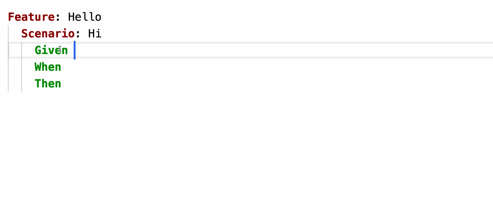

# Cucumber Suggest

This is a library that can be used to build Gherkin step auto-complete in editors.
It does not implement a UI component, but it can provide *suggestions* to an editor's auto-complete component.

Here is an example of a [Monaco editor](https://microsoft.github.io/monaco-editor/) using this library:



## Architecture

The suggest system consists of multiple components, each of which may run in a different process.

```
+--------------------+       +---------------+    +-------+
| Cucumber/Regular   |       |               |    |       |
| Expressions        |       | Gherkin Steps |    |       |
| (Step definitions) |       |               |    |       |
+----------+---------+       +-------+-------+    |       |
           |                         |            |       |
           |                         |            |       |
           +-------------+-----------+            |       |
                         |                        |       |
                         |                        |       |
               +---------v----------+             |       |
               | buildStepDocuments |             |       |
               |    (Transform)     |             |  ETL  |
               +---------+----------+             |       |
                         |                        |       |
                         |                        |       |
                         |                        |       |
                 +-------v--------+               |       |
                 | Step Documents |               |       |
                 +-------+--------+               |       |
                         |                        |       |
                         |                        |       |
                         |                        |       |
                   +-----v-----+                  |       |
                   |  Storage  |                  |       |
                   +-----^-----+                  +-------+
                         |
                +--------+-------+
                |                |
            +---+----+      +----+----+
            |  LSP   |      | Editor  |
            | Server |      | Plugin  |
            +---^----+      +----^----+
                |                |
                |                |
            +---+----+      +----+----+
            |  LSP   |      | Editor  |
            | Editor |      |(Non-LSP)|
            +--------+      +---------+
```

### ETL process for Step Documents

At the top right of the diagram is an [ETL](https://en.wikipedia.org/wiki/Extract,_transform,_load) process. Implementing
a full ETL process is currently beyond the scope of this library - it only implements the **transform** step. A full ETL
process would do the following:

First, **extract** [Cucumber Expressions](../../cucumber-expressions) and Regular Expressions from step definitions,
and the text from Gherkin Steps. This can be done by parsing [Cucumber Messages](../../messages) from Cucumber dry-runs.

Second, **transform** the expressions and steps to [Step Documents](#step-documents) using the `buildStepDocuments` function.

Third, **load** the *Step Documents* into a persistent storage. This can be a [search index](https://en.wikipedia.org/wiki/Search_engine_indexing),
or some other form of persistent storage (such as a file in a file system or a database).
See the [Search Index](#search-index) section below for more details.

### Editor suggest

This library does not implement any editor functionality, but it *does define* the *Step Document* data structure
on which editor auto-complete can be implemented. There are two ways to build support for an editor.

What is common for both approaches is that they will query a search index.

The `StepDocument`s coming back from an index search can be converted to an
[LSP Completion Snippet](https://microsoft.github.io/language-server-protocol/specifications/specification-3-17/#snippet_syntax)
using the `lspCompletionSnippet` function.

For example, this `StepDocument`:

`["I have ", ["42", "54"], " cukes in my ", ["basket", "belly"]]`

becomes the following LSP Completion Snippet:

`I have ${1|42,54|} cukes in my ${2|basket,belly|}`

### LSP

With the [LSP](https://microsoft.github.io/language-server-protocol/) approach, the storage is typically a 
[search index](https://en.wikipedia.org/wiki/Search_engine_indexing).
When the user invokes the auto-complete command in the editor, the editor will send a 
[completion request](https://microsoft.github.io/language-server-protocol/specifications/specification-3-17/#textDocument_completion) 
to the LSP server. The LSP server queries the search index, and uses the returned *Step Documents* to build the response to
the completion request.

### Dedicated plugin

With the dedicated plugin approach, the storage is typically a file system or a database.
When the editor plugin is loaded, it will fetch the *Step Documents* from the storage in raw form,
and add them to an embedded (in-memory) search index.

When the user invokes the auto-complete command in the editor, the editor plugin will query the in-memory search index
and use the editor's native API to present the suggestions.

## Examples

The examples below illustrate how the library works from the perspective of a user, with a full stack. The ETL process
and the index all run in-memory.

(Yep, this README.md file is executed by Cucumber.js)!

The suggestions in the examples use the
[LSP Completion Snippet syntax](https://microsoft.github.io/language-server-protocol/specifications/specification-3-17/#snippet_syntax)
to represent search results.

### Rule: Suggestions are based on both steps and step definitions

#### Example: Two suggestions from Cucumber Expression

* Given the following Gherkin step texts exist:
  | Gherkin Step                   |
  | ------------------------------ |
  | I have 23 cukes in my belly    |
  | I have 11 cukes on my table    |
  | I have 11 cukes in my suitcase |
  | the weather forecast is rain   |
* And the following Step Definitions exist:
  | Cucumber Expression                |
  | ---------------------------------- |
  | I have {int} cukes in/on my {word} |
  | the weather forecast is {word}     |
* When I type "cukes"
* Then the suggestions should be:
  | Suggestion                      |
  | ------------------------------- |
  | I have {int} cukes in my {word} |
  | I have {int} cukes on my {word} |

#### Example: Two suggestions from Regular Expression

* Given the following Gherkin step texts exist:
  | Gherkin Step                     |
  | -------------------------------- |
  | I have 23 cukes in my "belly"    |
  | I have 11 cukes in my "suitcase" |
* And the following Step Definitions exist:
  | Regular Expression                              |
  | ----------------------------------------------- |
  | /I have (\d\d) cukes in my "(belly\|suitcase)"/ |
* When I type "cukes"
* Then the suggestions should be:
  | Suggestion                 |
  | -------------------------- |
  | I have {} cukes in my "{}" |

The parameters are not named, because the regular expression doesn't have named capture groups.

#### Example: Choices for a selected suggestion

* Given the following Gherkin step texts exist:
  | Gherkin Step                   |
  | ------------------------------ |
  | I have 23 cukes in my belly    |
  | I have 11 cukes on my table    |
  | I have 11 cukes in my suitcase |
  | the weather forecast is rain   |
* And the following Step Definitions exist:
  | Cucumber Expression                |
  | ---------------------------------- |
  | I have {int} cukes in/on my {word} |
  | the weather forecast is {word}     |
* When I type "cukes"
* And I select the 2nd snippet
* Then the LSP snippet should be "I have ${1|11,23|} cukes on my ${2|belly,suitcase,table|}"

LSP-compatible editors such as
[Monaco Editor](https://microsoft.github.io/monaco-editor/) or
[Visual Studio Code](https://code.visualstudio.com/) can display these suggestions
as `I have {int} cukes in my {word}` and `I have {int} cukes on my {word}`.

When the user chooses a suggestion, the editor will focus the editor at the first parameter and
let the user choose between `11` or `23` (or type a custom value). When the user has made a choice,
the focus moves to the next parameter and suggests `belly`, `suitcase` or `table`.

### Rule: Suggestions must have a matching step definition

It isn't enough to type something that matches an existing step -
the existing step must also have a matching step definition.

#### Example: Nothing matches

* Given the following Gherkin step texts exist:
  | Gherkin Step                |
  | --------------------------- |
  | I have 42 cukes in my belly |
* And the following Step Definitions exist:
  | Step Definition Expression |
  | -------------------------- |
  | Something else             |
* When I type "cukes"
* Then the suggestions should be empty

## Implementation

This library consists of three parts

* Step Documents
* Search Index
* Presentation

### Step Documents

A *Step Document* is a data structure with the following properties:

* `suggestion` - what the user will see when a suggestion is presented in the editor
* `segments` - what the editor will use to *insert* a suggestion, along with choices for parameters

A *Step Document* can be represented as a JSON document. Here is an example:

    {
      "suggestion": "I have {int} cukes in my belly",
      "segments": ["I have ", ["42", "54"], " cukes in my ", ["basket", "belly"]]
    }

The `segments` field is an array of `Text` (a string) or `Choices` (an array of strings).
The purpose of the `Choices` is to present the user with *possible* values for step parameters.
The segments above could be used to write the following steps texts:

* `I have 42 cukes in my basket`
* `I have 54 cukes in my basket`
* `I have 42 cukes in my belly`
* `I have 54 cukes in my belly`

When a *Step Document* is added to a search index, it should use the `segments` field for indexing.

The `segments` field can also be used to build an
[LSP Completion Snippet](https://microsoft.github.io/language-server-protocol/specifications/specification-3-17/#snippet_syntax)

### Search Index

Each `StepDocument` can be added to a *search index*, either during the ETL process, or inside a dedicated editor plugin. 
The search index will return matching `StepDocument`s for a search term.

The index is a function with the following signature:

`type Index = (text: string) => readonly StepDocument[]`

There are three experimental search index implementations in this library:

* `fuseIndex` (based on [Fuse.js](https://fusejs.io/))
* `jsSearchIndex` (based on [JS Search](http://bvaughn.github.io/js-search/))
* `bruteForceIndex` (based on [String.prototype.includes()](https://developer.mozilla.org/en-US/docs/Web/JavaScript/Reference/Global_Objects/String/includes))

They are currently only in the test code, but one of them might be promoted to be part of the library at a later stage
when we have tried them out on real data.

See the `Index.test.ts` contract test for more details about how the indexes behave.

### Not in this library

It's beyond the scope of this library to implement an LSP server.
An LSP server could be built on this library though.

It is also beyond the scope of this library to provide any kind of UI component.
For LSP-capable editors this isn't even needed - it is built into the editor.

For non-LSP capable editors written in JavaScript (such as CodeMirror) it would be possible to
build an auto-complete plugin that uses one of the `Index` implementations in this library.
Building the `StepDocument`s could happen on a server somewhere, and could be transferred to
the browser over HTTP/JSON.
